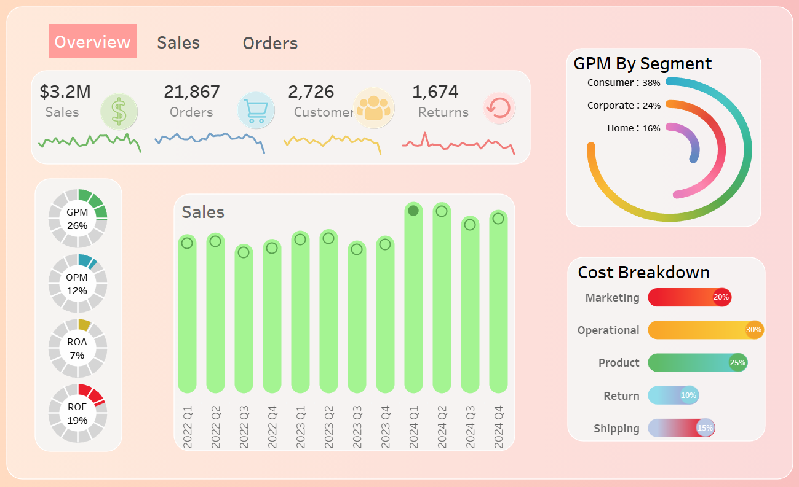

# Executive Sales and Profitability Dashboard

## Dashboard Overview

An interactive Tableau dashboard created to monitor sales performance, order volume, return rates, profitability metrics, and segment-based gross margin insights. This dashboard provides a clear visual of quarterly business trends and cost distribution to support financial strategy and operational efficiency.

- **Author:** Samiksha Kamath
- **Project Date:** Febuary 21st, 2025

---

## Project Overview

This project presents an **executive-level sales and profitability dashboard** designed to provide a consolidated view of **revenue performance, customer activity, operational efficiency, and margin structure**.  
The dashboard enables stakeholders to monitor **financial health, growth trends, and cost drivers** through a single, interactive interface.

The analysis focuses on **descriptive and diagnostic business intelligence**, supporting strategic and operational decision-making rather than predictive modelling.

---

## Business Objectives

The dashboard is designed to answer the following key business questions:

- How are sales, orders, and customer volume trending over time?
- What is the current profitability position across key financial ratios?
- Which customer segments contribute the highest gross profit margin?
- How are operational costs distributed across major expense categories?
- Are sales growth and profitability aligned?

---

## Key Performance Indicators

### Commercial Activity
- **Total Sales:** $3.2M  
- **Total Orders:** 21,867  
- **Total Customers:** 2,726  
- **Total Returns:** 1,674  

These KPIs provide a high-level snapshot of commercial scale and operational load.

---

### Profitability Metrics
- **Gross Profit Margin (GPM):** 26%  
- **Operating Profit Margin (OPM):** 12%  
- **Return on Assets (ROA):** 7%  
- **Return on Equity (ROE):** 19%  

These ratios enable rapid assessment of **margin efficiency and capital effectiveness**.

---

## Analytical Components

### Sales Trend Analysis
- Quarterly sales performance from **2022 Q1 to 2024 Q4**
- Identification of growth acceleration and seasonal variation
- Visual comparison of recent performance against historical baseline

---

### Segment-Level Profitability
Gross Profit Margin (GPM) contribution by customer segment:

- **Consumer:** 38%  
- **Corporate:** 24%  
- **Home:** 16%  

This highlights which customer groups generate the highest margin contribution and supports **segment prioritisation strategies**.

---

### Cost Structure Analysis

The dashboard decomposes total costs into key operational categories:

- **Operational Costs:** 30%  
- **Product Costs:** 25%  
- **Marketing:** 20%  
- **Shipping:** 15%  
- **Returns:** 10%  

This breakdown enables visibility into **cost concentration, efficiency gaps, and optimisation opportunities**.

---

## Dashboard Interactivity

The dashboard supports interactive analysis through:

- Tab-based navigation (Overview, Sales, Orders)
- Dynamic filtering across KPIs and charts
- Hover tooltips for detailed metric inspection

All visuals update automatically, enabling rapid exploration without modifying source data.

---

## Tools and Technologies

- **Business Intelligence Tool**
  - KPI cards and ratio indicators
  - Time-series trend charts
  - Segment-level profitability visuals
  - Cost decomposition analysis
- **Structured financial and sales dataset**
  - Transaction-level aggregation
  - Customer and segment attributes
  - Cost and margin components

---

## Use Cases

- Executive performance reporting
- Sales and profitability monitoring
- Cost optimisation analysis
- Segment-level strategy evaluation
- Quarterly business reviews

---

## Key Insights

- Sales growth is supported by strong order and customer volume
- Profitability remains healthy, with solid gross and operating margins
- Consumer segment is the primary driver of gross profit
- Operational and product costs represent the largest expense areas
- Returns contribute a non-trivial share of total costs and warrant monitoring

---

## Limitations

- Analysis is descriptive and diagnostic only
- No predictive forecasting or scenario simulation is included
- Cost drivers are analysed at an aggregate level
- Results represent a fixed historical reporting window

---

## Conclusion

This dashboard provides a **clear, executive-ready view of sales performance and profitability**, integrating operational scale, margin health, and cost structure into a single analytical framework.  
By aligning revenue growth with financial efficiency metrics, the dashboard supports **informed strategic decision-making and performance management**.

The framework can be extended to include **forecasting, margin decomposition, and scenario analysis** in future iterations.
